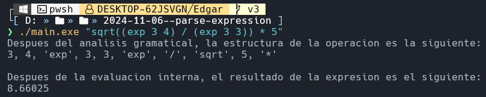
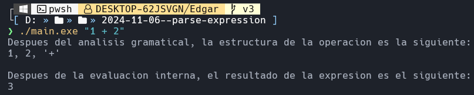
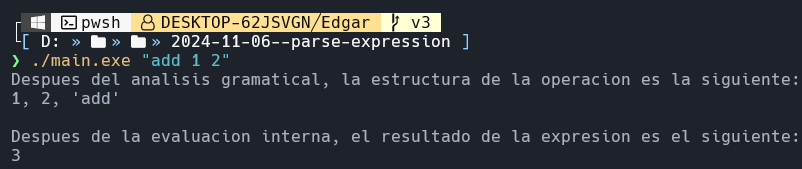
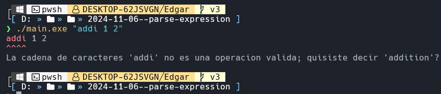
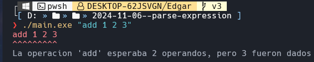
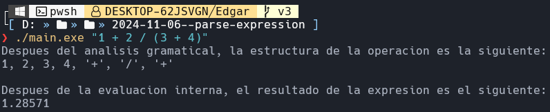
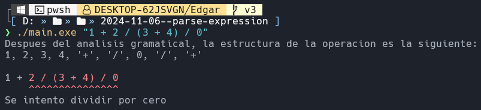
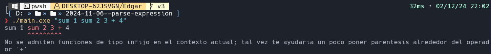

# Traducción de Infijo a Postfijo



Este proyecto consiste en un intérprete de expresiones aritméticas escrito en C; su realización fue supervisada enteramente por Edgar Trejo Avila, como asignatura del profesor Gregorio Rodríguez Miranda para la clase de Estructuras de Datos Aplicadas de la Universidad Tecnológica de San Juan del Río, en el periodo comprendido entre septiembre y diciembre del 2024.

## Tecnologías Utilizadas

- **Neovim** como editor de texto
- **C** como lenguaje de programación
- **GCC** como compilador del programa

## Características

- Interpretación de operaciones aritméticas de varios operadores de longitud introducidas por la consola \
  Está garantizado que el programa puede resolver operaciones sin paréntesis, pero tiene problemas para evaluar correctamente aquellas con paréntesis o paréntesis anidados

- Soporte para funciones de infijo (con aridad 2 y precedencia variable) y prefijo (con aridad variable y precedencia constante)

- Letrero que muestra el orden en que será evaluada la expresión según el stack interno del programa

- Mensajes que indican errores (lógicos o de sintaxis) cometidos por el usuario \
  El programa cuenta con un sistema que indeitifica los errores que el usuario probablemente cometió al escribir una operación incorrecta, y le ayuda a corregir dichos errores por medio de mensajes de ayuda y subrayado en las partes erróneas

- Módulo de testeo \
  En la carpeta `source` vienen incluidos algunos archivos con el prefijo `testing` que sirven para probar el programa en diferentes aspectos

## Compilación

Los siguientes scripts se pueden ejecutar desde la consola de la plataforma correspondiente para compilar el proyecto.

### Windows (usando PowerShell)

```ps1
if (!(Test-Path -Path "bin")) {
    New-Item -ItemType Directory -Path "bin"
}

# Listar archivos .c en la carpeta source
$sourceFiles = Get-ChildItem -Path "source" -Filter "*.c"

# Compilar cada archivo .c en un archivo .o dentro de bin/
foreach ($file in $sourceFiles) {
    $objectFile = "bin\$($file.BaseName).o"
    Write-Host "Compilando $($file.Name) -> $objectFile"
    gcc -c $file.FullName -o $objectFile
}

# Compilar main.c y enlazar con los archivos .o en bin/
$objectFiles = Get-ChildItem -Path "bin" -Filter "*.o" | ForEach-Object { $_.FullName }
gcc main.c $objectFiles -o main.exe
```

### Linux (usando Bash)

```bash
# Crear carpeta bin si no existe
mkdir -p bin

# Listar archivos .c en la carpeta source
source_files=$(find source -type f -name "*.c")

# Compilar cada archivo .c en un archivo .o dentro de bin/
for file in $source_files; do
    object_file="bin/$(basename "$file" .c).o"
    echo "Compilando $file -> $object_file"
    gcc -c "$file" -o "$object_file"
done

# Compilar main.c y enlazar con los archivos .o en bin/
gcc main.c bin/*.o -o main.exe
```

## Demostración de Uso

Las siguientes imágenes sirven de testimonio para los casos en los que el programa actúa como planeado:

### Expresión Sencilla



### Expresión Sencilla con Función de Prefijo



### Expresión Sencilla con Función de Prefijo Errónea



### Expresión Sencilla con Función de Prefijo con Demasiados Argumentos



### Expresión Más Compleja



### División por Cero



### Operación en una Posición Inválida



### Operación más Compleja


